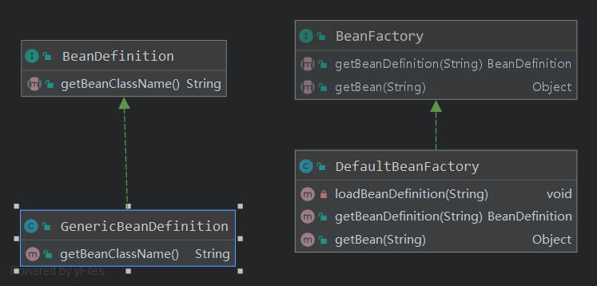
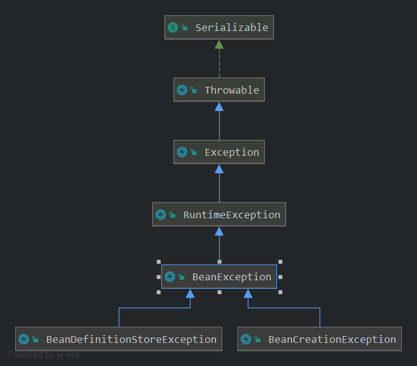

# Bean Factory
在开始前重新复习下 TDD 的步骤：
1. **思考**，编写错误的测试用例
2. 编写代码，使测试通过
## 第一个测试用例
给定一个 `xml` 的配置文件，能够从中获取：
1. `Bean` 的定义
2. `Bean` 的实例
3. 仅仅使用默认的缺省构造函数创建对象

### 1. 编写测试用例 (commit id : `b796210`)

```java
/**
 * Test to get entity form xml files.
 * <p>
 * Goal: get bean definition from xml file.
 */
@Test
public void testGetBean() {
    // beanFactory is an interface
    BeanFactory factory = new DefaultBeanFactory("wind-v1.xml");
    // get bean definition form bean factory
    BeanDefinition bd = factory.getBeanDefinition("wind"); // id

    // judge if is equals to the bean we expected: by class name
    // expected, real value
    assertEquals("org.breeze.service.v1.Wind", bd.getBeanClassName());

    // get the instance
    Wind wind = (Wind) factory.getBean("wind");
    assertNotNull(wind);
}
```
在里面定义了 2 个接口和两个实现类：



现在的代码肯定是不会通过的需要填写代码；
## 2. 填写代码，来通过测试 (commit id: 7ad2d1a)

需要注意的是：`ClassUtils` 中的 `getDefaultClassLoader` 方法。
即使Spring 5 中的同名方法：**获取ClassLoader的顺序**

```java
@Nullable
public static ClassLoader getDefaultClassLoader() {
    ClassLoader loader = null;
    try {
        loader = Thread.currentThread().getContextClassLoader();
    } catch (Throwable ignored) {
        // Cannot access thread context ClassLoader-> falling back.
    }
    if (loader == null) {
        // No thread context class loader -> use class loader of this class.
        loader = ClassUtils.class.getClassLoader();
        if (loader == null) {
            // <code>getClassLoader()</code> return null indicates the bootstrap ClassLoader.
            try {
                loader = ClassLoader.getSystemClassLoader();
            } catch (Throwable ignored) {
                // Cannot assess system ClassLoader,may be the caller can live with null :).
            }
        }
    }
    return loader;
}
```
 
Unit test then passed, need to refactor code and improve code,then write unit test.
## 3. refactor code.

### Try catch problems
很多的 `try catch` 不方便阅读。
1. 引入 `excetion` 来处理复杂的、繁多的 `try...catch...`
2. warp an exception.



-`BeanDefinitionStoreException`: 读取文件错误时候的抛出的异常
- `BeanCreationException`: 创建 Bean 实例时候的抛出的异常

then write exception test unit.
```java
@Test
// Test BeanCreationException
public void testInvalidBean() {
    DefaultBeanFactory factory = new DefaultBeanFactory("wind-v1.xml");
    try {
        factory.getBean("invalidBean");
    } catch (BeanCreationException e) {
        return;
    }
    Assert.fail("Expect BeanCreationException");
}

@Test
// Test BeanCreationException
public void testInvalidXML() {
    try {
        new DefaultBeanFactory("test.xml");
    } catch (BeanDefinitionStoreException e) {
        return;
    }
    Assert.fail("Expect BeanDefinitionStoreException");
}
```

（完）
---
✨
- ClassLoader的获取顺序
- 